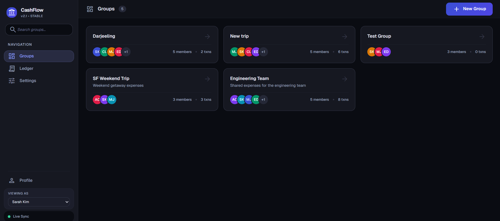
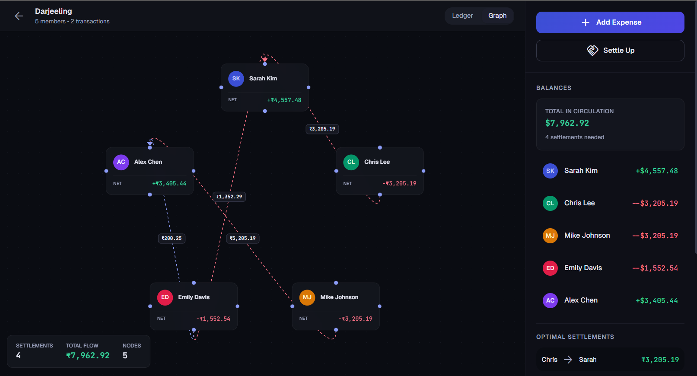
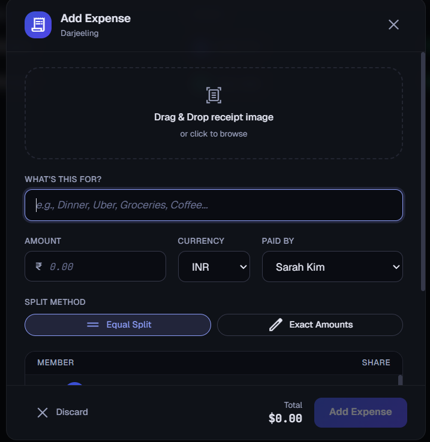
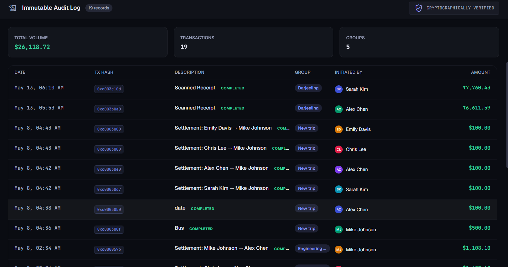
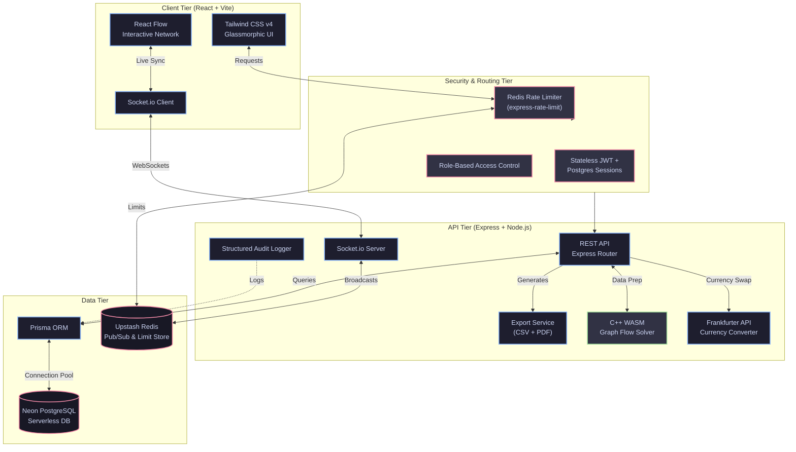

# CashFlow Management v2.0

🚀 **Live Demo:** [https://cashflow-phi-amber.vercel.app/](https://cashflow-phi-amber.vercel.app/)

> Enterprise-grade debt minimization platform powered by an Optimized Directed Graph Minimization Engine. Minimize complex debt networks among groups in real-time.

## Key Features

- **Real-Time Debt Minimization**: Automatically calculates the most efficient settlement paths using a C++ WASM solver.
- **Enterprise-Grade Security**: Stateless JWT Authentication paired with PostgreSQL-backed session tracking, providing immediate token revocation.
- **Role-Based Access Control (RBAC)**: Fine-grained permissions featuring `ADMIN`, `MEMBER`, and read-only `AUDITOR` roles.
- **Production Hardened**: Distributed Upstash Redis rate limiters, structured JSON logging, and cursor-based pagination for high-throughput endpoints.
- **Immutable Audit Trails**: Paginated, verifiable logs tracking all critical group actions (expenses, role changes, settlements).
- **Data Export Pipeline**: One-click generation of PDF summary reports and CSV ledgers via `pdfkit` and `csv-stringify`.
- **Glassmorphic UI**: Premium, modern interface built with Tailwind CSS v4, featuring micro-animations and responsive layouts.
- **Interactive Graphs**: Visualizes the flow of debts using React Flow with real-time WebSockets synchronization.
- **WASM OCR Receipt Scanning**: Drag-and-drop receipt scanning powered by client-side Tesseract.js.
- **Multi-Currency Support**: Real-time dynamic exchange rate conversion via Frankfurter API.

## Screenshots
| | |
|:---:|:---:|
|  <br/> **Dashboard View** |  <br/> **Interactive Debt Graph** |
|  <br/> **WASM OCR Receipt Scanning** |  <br/> **Global Ledger** |

## Architecture



## Tech Stack

| Layer | Technology |
|-------|-----------|
| Frontend | React 19, Vite 6, Tailwind CSS v4, React Flow |
| Backend | Node.js, Express 5, TypeScript, Socket.io |
| Algorithm | C++ (Graph Optimizer) → WebAssembly via Emscripten |
| Database | Neon (Serverless PostgreSQL) + Prisma ORM |
| Real-Time | Socket.io + Redis Pub/Sub (Upstash) |
| DevOps | Docker, Docker Compose |

## Quick Start

### Prerequisites
- Node.js ≥ 20
- [Neon](https://neon.tech) account (free — serverless PostgreSQL)
- [Upstash](https://upstash.com) account (free — serverless Redis)

### Infrastructure Setup

1. **Neon PostgreSQL**: Create a project → copy the connection string. Add `&connect_timeout=30&pool_timeout=30` to prevent serverless cold-start errors.
2. **Upstash Redis**: Create a database → copy the `rediss://` connection URL (TLS)
3. Copy `.env.example` → `apps/server/.env` and fill in your credentials

### Local Development

```bash
# 1. Clone and install
npm install

# 2. Set up environment (fill in Neon + Upstash credentials)
cp .env.example apps/server/.env

# 3. Push database schema to Neon
cd apps/server && npx prisma db push && cd ../..

# 4. Seed demo data
cd apps/server && npx tsx src/prisma/seed.ts && cd ../..

# 5. Start backend
npm run dev:server

# 6. Start frontend (new terminal)
npm run dev:web
```

### Docker Compose (Full Stack)

```bash
docker compose up --build
```

- Frontend: http://localhost:3000 (Docker) / http://localhost:5173 (dev)
- Backend: http://localhost:4000
- API Health: http://localhost:4000/api/health

### Production Deployment Notes
If deploying to free-tier services like Render and Neon, we recommend setting up an external cron-job via `cron-job.org` to ping `/api/groups` every 14 minutes. This prevents the server and database from spinning down during periods of inactivity, preventing high-latency cold starts.

## Core Algorithm

The debt minimization utilizes an **Optimized Directed Graph Minimization Engine** to dynamically compute the most efficient settlement paths in real-time.

1. Compute net balance per entity across the financial network.
2. Construct dynamic flow graphs for positive (credit) and negative (debt) edges.
3. Greedily resolve multi-layered debt networks using advanced Disjoint Set Union (DSU) heuristics.
4. Settle optimized paths and dynamically re-evaluate the graph for non-linear cycles.
5. Produces optimal **O(N-1)** minimum-edge settlement paths.

Performance Benchmarks (Ops/sec on standard hardware):
- **10 users (14 edges):** ~291,000 ops/sec
- **50 users (497 edges):** ~19,500 ops/sec
- **100 users (2011 edges):** ~5,600 ops/sec
- **500 users (49k edges):** ~220 ops/sec
- **1000 users (199k edges):** ~53 ops/sec

Highly optimized for large-scale enterprise data — handles dense networks of 1,000 entities in <20ms.

## API Endpoints

| Method | Endpoint | Description |
|--------|----------|-------------|
| GET | `/api/health` | Server health check (DB ping included) |
| POST | `/api/auth/register` | Register user (Rate limited) |
| POST | `/api/auth/login` | Login & receive JWT |
| POST | `/api/auth/logout` | Revoke DB Session |
| POST/GET | `/api/users` | User CRUD |
| POST/GET | `/api/groups` | Group CRUD (Cursor paginated) |
| POST/DELETE | `/api/groups/:id/members` | Member management (ADMIN only) |
| PATCH | `/api/groups/:id/members/:userId/role` | Change member role |
| POST/GET | `/api/groups/:id/transactions` | Transaction CRUD (Paginated) |
| GET | `/api/groups/:id/settlements` | Compute minimized debts |
| GET | `/api/groups/:id/exports/csv` | Download CSV Ledger |
| GET | `/api/groups/:id/exports/pdf` | Download PDF Summary |
| GET | `/api/audit-logs` | Global immutable audit logs |

## Project Structure

```
CashFlow-Management/
├── apps/
│   ├── web/                 # React + Vite frontend
│   │   ├── src/
│   │   │   ├── components/  # Sidebar, Layout, DebtGraph, ExpenseModal
│   │   │   ├── pages/       # GroupsPage, GroupDetailPage
│   │   │   ├── hooks/       # useApi, useSocket
│   │   │   ├── lib/         # API client, Socket client
│   │   │   └── types/       # TypeScript interfaces
│   │   └── Dockerfile
│   │
│   └── server/              # Express + TypeScript backend
│       ├── src/
│       │   ├── routes/      # users, groups, transactions
│       │   ├── services/    # Business logic + solver
│       │   ├── middleware/  # Validation, error handling
│       │   ├── socket/      # Socket.io server
│       │   ├── wasm/        # WASM loader bridge
│       │   └── prisma/      # Schema + seed
│       └── Dockerfile
│
├── packages/
│   └── solver/              # C++ → WebAssembly solver
│       ├── src/solver.cpp
│       ├── CMakeLists.txt
│       └── build.sh
│
├── docker-compose.yml
└── package.json
```

## License

MIT
