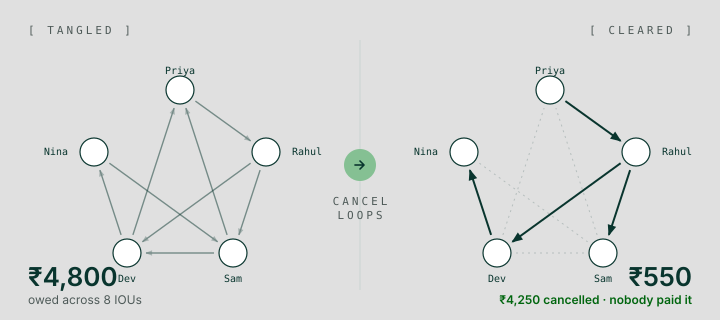

<div align="center">

# CashFlow

**Some of what your group owes runs in circles. It can be struck off without anyone paying.**

[](https://github.com/SanishKumar/Cashflow/actions/workflows/ci.yml)
[](LICENSE)
[](package.json)
[](#verifying-the-repository)

[Live demo](https://cashflow-phi-amber.vercel.app/) · [How it works](#how-it-works) · [The engine](#the-clearing-engine) · [Run it locally](#run-it-locally)

</div>



---

## The idea

Five friends, eight IOUs, ₹4,800 outstanding. But Priya owes Rahul, Rahul owes Sam, and Sam owes Priya — that loop is money chasing its own tail. It can be cancelled outright. Nobody pays anything, nobody's net position changes, and nobody ends up owing a stranger.

Do that everywhere it occurs and ₹4,800 becomes ₹550 across four payments.

Every expense app has a *simplify debts* button. It goes further than this — and to do it, it quietly makes people owe strangers. Splitwise's own documentation admits it "makes changes not only to your account, but also to the accounts of your friends — including balances that you can't see."

CashFlow makes that a choice, shows what each option costs, and lets you take the safe one.

|  | Cancel loops | Simplify all |
| --- | --- | --- |
| Clears | Closed loops only | Loops **and** open chains |
| New counterparties | **Never any** | Yes — and it names them |
| Net positions | Unchanged | Unchanged |

## How it works

**The graph is the interface.** There's no dashboard summarising a system you can't see — you land in the money graph itself. People are nodes, debts are edges, and money flows along them as you watch.

- **Pick a mode.** *As owed* shows the tangle. *Cancel loops* is risk-free by construction. *Simplify all* is the aggressive option, with its cost stated up front.
- **See what it costs.** Every mode reports how much cleared, how many payments remain, and exactly how many people would end up owing someone new.
- **Instant.** The clearing engine runs in your browser, so switching modes never touches the server.
- **Scan a receipt.** Photograph a bill and the items, total, tax and tip are read off it — with an honest score for how much of that the parser could actually verify.

Everything else you'd expect is there: groups with roles, an audit trail, realtime updates, CSV and PDF export, multi-currency.

> **CashFlow records who owes whom. It never connects to a bank or moves money.**

<!--
  TODO: demo recording.
  Record at 1440x900, light theme, signed out so the sample network loads:
    1. land on / with the tangled graph
    2. click "Cancel loops" and let the edges dissolve
    3. click "Simplify all" so the red new-counterparty edges appear
    4. drag a node to show it is live
  Save as docs/demo.gif and swap the SVG above for it.
-->

## The clearing engine

[`packages/clearing`](packages/clearing) is a standalone, dependency-free package. It is the reason this project exists.

```ts
import { clear } from "@cashflow/clearing";

const safe = clear(obligations, { mode: "cycles" });
safe.metrics.noNewCounterparties;  // always true
safe.metrics.cleared;              // debt that evaporated

const aggressive = clear(obligations, { mode: "paths" });
aggressive.metrics.newPairs;       // exactly who now owes someone new
```

A party can also refuse one specific exposure without opting out of clearing, via `forbiddenPairs`.

<details>
<summary><b>How cycle clearing is solved</b></summary>

<br>

Cycle-restricted clearing is a **maximum-circulation** problem. A flow that respects every obligation as a capacity and conserves value at every party cannot change anyone's net position — conservation *is* the safety guarantee — so maximising total flow maximises the debt that simply cancels.

That's a minimum-cost circulation with a cost of −1 per unit, solved in two phases:

1. **Saturate directed cycles** by depth-first search. Cheap, and it recovers most of the value.
2. **Cancel negative-cost cycles** in the residual network until none remain. A circulation is optimal exactly when its residual has no negative cycle, which is what makes the answer provably maximal.

Phase two is queue-driven Bellman-Ford that catches a cycle the moment it forms, by checking whether a relaxation would close a loop in the predecessor tree. The textbook SPFA test — waiting for a relaxation counter to exceed the node count — measured about 25× slower here.

Path compensation then lifts intermediaries out of open chains until nobody sits in the middle, which drives the total down to the **floor**: the sum of all positive net positions, the least any net-preserving method can leave outstanding.

Amounts are integer minor units throughout. Clearing adds and subtracts these thousands of times, and floating point would let rounding error accumulate into the settlement instructions themselves.

</details>

### What it clears

`npm run bench:clearing` — seeded and reproducible.

```
network                      pairs  gross        cycles  paths   new pairs (cyc/path)
---------------------------  -----  -----------  ------  ------  --------------------
friends group                15     198,854      23.77%  45.12%  0 / 0
unstructured cluster         2756   26,555,348   57.33%  71.24%  0 / 509
supply chain (5 tiers)       2598   24,763,077   27.76%  63.42%  0 / 882
supply chain (8 tiers)       4966   46,821,748   20.41%  62.87%  0 / 2151
regional supply chain        13935  122,584,346  22.88%  64.02%  0 / 6703
```

Two things worth reading carefully.

**Topology decides everything.** Real trade is hierarchical — a retailer owes a wholesaler owes a manufacturer — and a purely hierarchical network is acyclic, leaving loop clearing nothing to cancel. The unstructured row is *not* representative; the supply-chain rows are. [arXiv 2606.26126](https://arxiv.org/abs/2606.26126) reports **20.99%** for cycle-restricted netting across 133,191 real invoices worth €19.67bn, and the 8-tier network here independently lands at **20.41%**.

**The extra relief is bought with exposure.** On the regional network, moving from `cycles` to `paths` clears another 41% — and manufactures **6,703 counterparty relationships that did not previously exist**.

This isn't a toy problem. Slovenia's AJPES runs national multilateral set-off, clearing €683M in 2012 — 1.89% of GDP — across 14,000 companies, with demand rising counter-cyclically during liquidity crises ([research](https://www.mdpi.com/1911-8074/13/12/295)).

## Run it locally

You'll need Node.js 20+, PostgreSQL and Redis.

```bash
git clone https://github.com/SanishKumar/Cashflow.git
cd Cashflow
npm install
cp .env.example apps/server/.env
```

Set `DATABASE_URL`, `REDIS_URL`, `JWT_SECRET` and `CORS_ORIGIN` in `apps/server/.env`, then:

```bash
npm run db:migrate:deploy && npm run db:seed
```

Two terminals:

```bash
npm run dev:server
```

```bash
npm run dev:web
```

The app is on `http://localhost:5173`, the API on `http://localhost:4000`. Seeded accounts are printed by the seed script. Set `APP_URL` if links should point somewhere other than `CORS_ORIGIN`.

### Verifying the repository

```bash
npm run verify
```

ESLint, all three test suites (server, web, clearing), the server TypeScript build and the production Vite build. CI runs the same command and audits production dependencies.

## Under the hood

| Layer | Built with |
| --- | --- |
| Web | React 19, TypeScript, Vite, Tailwind CSS |
| Graph | Hand-rolled canvas renderer — force layout, particle flow, no graph library |
| Clearing | Dependency-free TypeScript, runs in the browser |
| API | Express 5, TypeScript, Zod |
| Data | PostgreSQL, Prisma, integer minor units end to end |
| Realtime | Socket.io over Redis, membership-checked rooms |
| Auth | Rotating refresh sessions, bcrypt, in-memory access tokens |
| Testing | Vitest, Testing Library, Supertest |

A few things that took real care:

- **Server-enforced roles.** Admins manage a group, members add and settle, auditors read. Checked on the server, never inferred in the client.
- **Scoped audit trail.** Group, expense, role and settlement events are recorded without leaking activity across groups you don't belong to.
- **Fixed-point money.** PostgreSQL decimal columns and cent-based arithmetic throughout. No floating-point drift in a stored balance.
- **Receipt parsing that admits what it doesn't know.** Confidence is scored from whether a total line was found, whether items were read, and whether they reconcile — not a constant dressed up as a model score.

## Project layout

```
packages/clearing/     Obligation-clearing engine, benchmark, tests
apps/web/              React app — money graph, groups, ledger
apps/server/           Express API, services, socket server
apps/server/prisma/    Schema and versioned migrations
packages/solver/       Optional C++/WebAssembly minimum-transfer solver
docs/                  Deployment notes
```

Reviewing the code? Start with the [circulation solver](packages/clearing/src/circulation.ts) and [path compensation](packages/clearing/src/compensation.ts). After that: the [canvas graph](apps/web/src/components/MoneyGraph.tsx), the [obligation graph endpoint](apps/server/src/services/transactionService.ts), and the [security model](SECURITY.md).

## Deployment

Vercel for the frontend, Render for the API. HTTP traffic is reverse-proxied through the Vercel origin so the refresh cookie stays first-party, while Socket.io connects directly with a short-lived access token. Full checklist in [docs/DEPLOYMENT.md](docs/DEPLOYMENT.md).

## License

[MIT](LICENSE) · [Security](SECURITY.md) · [Privacy](PRIVACY.md)
