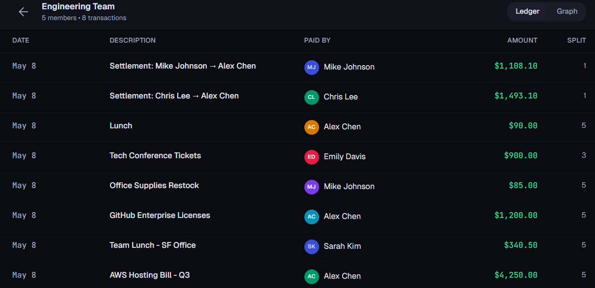

# CashFlow

[](https://github.com/SanishKumar/Cashflow/actions/workflows/ci.yml)
[](LICENSE)
[](package.json)

**Some debt cancels itself. The rest has to be paid.**

Where obligations form a loop — A owes B, B owes C, C owes A — they can be cancelled outright. Nobody's net position moves and nobody gains a counterparty. Going further clears far more, but only by making people owe strangers.

Every mainstream expense app ships one button that does the second thing silently. Splitwise's own documentation admits simplification "makes changes not only to your account, but also to the accounts of your friends — including balances that you can't see."

CashFlow makes that a choice, measures what it costs, and shows you both answers.

[Clearing demo](https://cashflow-phi-amber.vercel.app/clearing) · [Expense demo](https://cashflow-phi-amber.vercel.app/demo) · [Open the app](https://cashflow-phi-amber.vercel.app/) · [Security](SECURITY.md) · [Privacy](PRIVACY.md)

Both demos need no account and run on fictional data. The clearing demo runs the engine entirely in your browser — nothing is sent anywhere.

## The clearing engine

[`packages/clearing`](packages/clearing) is a standalone, dependency-free multilateral obligation-clearing engine. Two modes, both of which preserve every party's net position exactly:

| Mode | What it does | New counterparties |
| --- | --- | --- |
| `cycles` | Cancels obligations only where they form a closed loop | **Never any** |
| `paths` | Also lifts intermediaries out of open chains | Yes — and it reports which |

Cycle-restricted clearing is a **maximum-circulation** problem. A flow that respects each obligation as a capacity and conserves value at every party cannot change anyone's net position — conservation *is* the safety guarantee — so maximising total flow maximises the obligation value that simply cancels. That is a minimum-cost circulation with a cost of −1 per unit, solved by saturating directed cycles and then cancelling negative-cost cycles in the residual until none remain, which is what makes the answer provably maximal.

```ts
import { clear } from "@cashflow/clearing";

const safe = clear(obligations, { mode: "cycles" });
safe.metrics.noNewCounterparties; // always true

const aggressive = clear(obligations, { mode: "paths" });
aggressive.metrics.newPairs; // exactly who now owes someone new
```

A party can also refuse one specific exposure without opting out of clearing, via `forbiddenPairs`.

### What it clears

`npm run bench:clearing` — seeded and reproducible.

```
network                      pairs  gross        cycles  paths   new pairs (cyc/path)
---------------------------  -----  -----------  ------  ------  --------------------
friends group                15     198,854      23.77%  45.12%  0 / 0
unstructured cluster         2756   26,555,348   57.33%  71.24%  0 / 509
supply chain (5 tiers)       2598   24,763,077   27.76%  63.42%  0 / 882
supply chain (8 tiers)       4966   46,821,748   20.41%  62.87%  0 / 2151
regional supply chain        13935  122,584,346  22.88%  64.02%  0 / 6703
```

Topology dominates the cycle figure. Real trade is largely hierarchical — a retailer owes a wholesaler owes a manufacturer — and a purely hierarchical network is acyclic, leaving loop-clearing nothing to cancel. The unstructured row is *not* representative; the supply-chain rows are. For reference, [arXiv 2606.26126](https://arxiv.org/abs/2606.26126) reports **20.99%** for cycle-restricted netting on a real corpus of 133,191 invoices worth €19.67bn, and the 8-tier network here independently lands at 20.41%.

The extra relief is bought with exposure: on the regional network, moving from `cycles` to `paths` clears an additional 41% — and creates **6,703 counterparty relationships that did not previously exist**.

This is not a toy problem. Slovenia's AJPES runs national multilateral set-off, clearing €683M in 2012 (1.89% of GDP) across 14,000 companies, and [the research on it](https://www.mdpi.com/1911-8074/13/12/295) shows demand rising counter-cyclically during liquidity crises.

## A look at the app

### The settlement desk

The dashboard brings together payments to send, payments waiting for confirmation, group balances, and recent activity.


### Group ledger

The ledger keeps expenses and settlement history readable without losing who initiated each entry.



## What makes it interesting

- **Recipient-confirmed settlements.** A payment affects balances only after the named recipient confirms it. Senders can cancel pending claims; recipients can reject incorrect ones.
- **A solver with an explicit contract.** Money is converted to integer cents. Typical groups with up to 12 non-zero balances use an exact minimum-transaction search; larger groups use a deterministic greedy fallback.
- **Server-enforced roles.** Admins manage a group, members add expenses and settle balances, and auditors get read-only access.
- **An authorization-scoped audit trail.** Group, expense, role, and settlement events are recorded without exposing activity across groups.
- **Fixed-point financial data.** PostgreSQL decimal columns and cent-based calculations avoid floating-point drift in stored balances.
- **Short-lived browser sessions.** Access tokens live in memory, refresh tokens are hashed, rotated, and delivered through secure HTTP-only cookies.
- **Realtime group updates.** Socket.io rooms are authenticated and membership-checked before clients can subscribe.
- **Receipt-assisted entry.** Uploaded images are validated, processed in memory, and sent to the external OCR provider only after explicit consent.
- **Practical exports.** CSV ledgers preserve base-currency and original-currency values separately; settlement plans can be exported as PDF.

CashFlow records shared expenses and payment confirmations. It does not connect to bank accounts or move money.

## Settlement lifecycle

```text
Expense added
      ↓
Balances recalculated
      ↓
Settlement plan generated
      ↓
Sender marks payment as sent
      ↓
Recipient confirms ─── or ─── rejects
      ↓
Confirmed payment updates the ledger
```

Settlement decisions use optimistic concurrency on the server, so two confirmation requests cannot complete the same pending payment twice.

## Tech stack

| Layer | Technology |
| --- | --- |
| Web | React 19, TypeScript, Vite, Tailwind CSS |
| API | Express 5, TypeScript, Zod |
| Data | PostgreSQL, Prisma |
| Realtime | Socket.io, Redis pub/sub |
| Auth | Rotating refresh sessions, bcrypt, JWT |
| Solver | TypeScript with an optional C++/WebAssembly implementation |
| Testing | Vitest, Testing Library, Supertest |
| Hosting | Vercel frontend, Render API |

## Run locally

You will need Node.js 20+, PostgreSQL, and Redis.

```bash
git clone https://github.com/SanishKumar/Cashflow.git
cd Cashflow
npm install
cp .env.example apps/server/.env
```

Set `DATABASE_URL`, `REDIS_URL`, `JWT_SECRET`, and `CORS_ORIGIN` in `apps/server/.env`, then prepare the database:

```bash
npm run db:migrate:deploy
npm run db:seed
```

Start the API and web app in separate terminals:

```bash
npm run dev:server
npm run dev:web
```

The frontend runs on `http://localhost:5173`; the API runs on `http://localhost:4000`.

## Verify the repository

The same command runs locally and in GitHub Actions:

```bash
npm run verify
```

It runs ESLint, all three test suites (server, web, clearing), the server TypeScript build, and the production Vite build. Production dependencies are also audited in CI.

## Repository map

```text
packages/clearing/     Multilateral obligation-clearing engine, benchmark, tests
apps/web/              React application and component tests
apps/server/           Express API, services, socket server, and API tests
apps/server/prisma/    Prisma schema and versioned PostgreSQL migrations
packages/solver/       Optional C++/WebAssembly settlement solver
docs/                  Deployment notes and product screenshots
```

If you are reviewing the project, the most interesting code is the [circulation solver](packages/clearing/src/circulation.ts) and [path compensation](packages/clearing/src/compensation.ts). After that: the [settlement-payment service](apps/server/src/services/settlementPaymentService.ts), [minimum-transfer solver](apps/server/src/services/solver.ts), [Socket.io authorization](apps/server/src/socket/socketServer.ts), and [security model](SECURITY.md).

## Deployment

The hosted version uses Vercel for the frontend and Render for the API. HTTP API traffic is reverse-proxied through the Vercel origin so the refresh cookie remains first-party, while Socket.io connects directly with a short-lived access token.

The complete release checklist is in [docs/DEPLOYMENT.md](docs/DEPLOYMENT.md).

## License

Released under the [MIT License](LICENSE).
