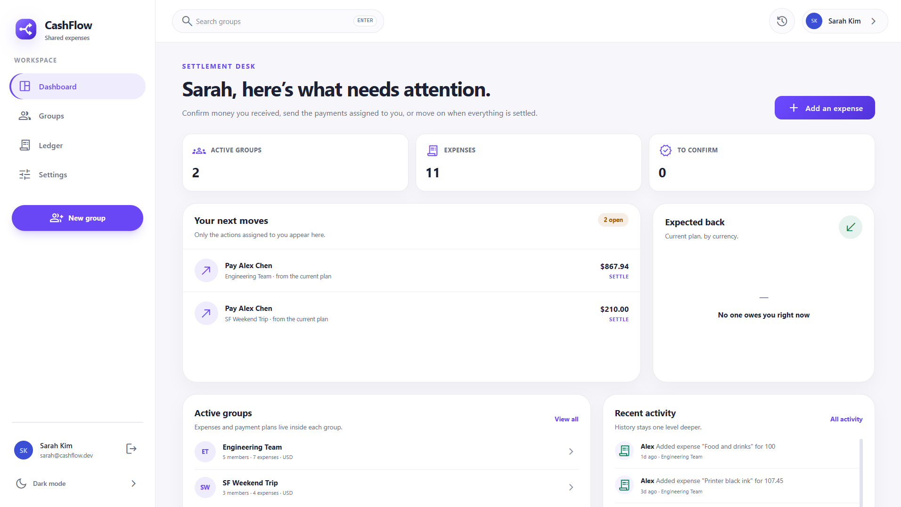
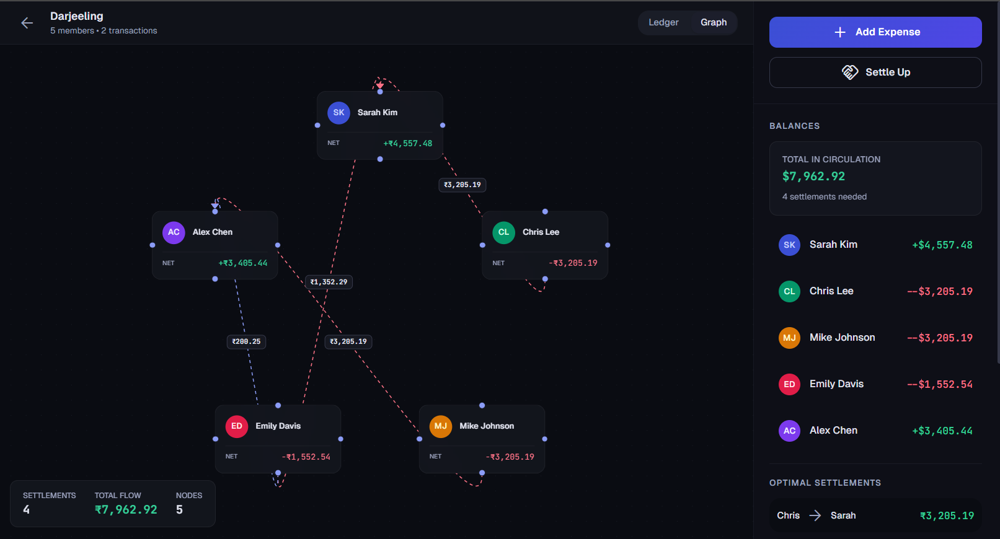
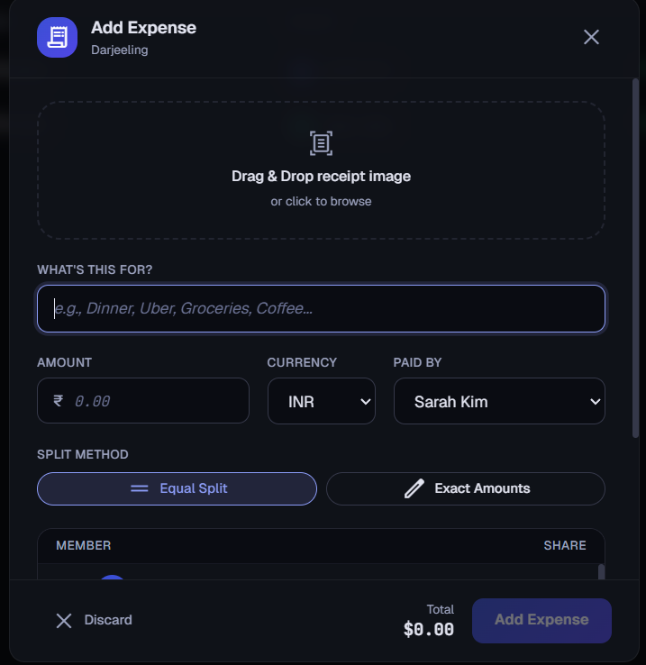
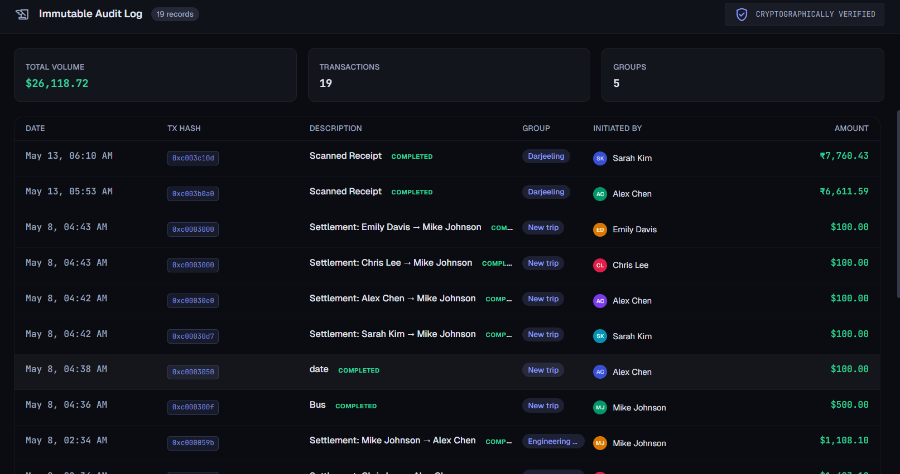
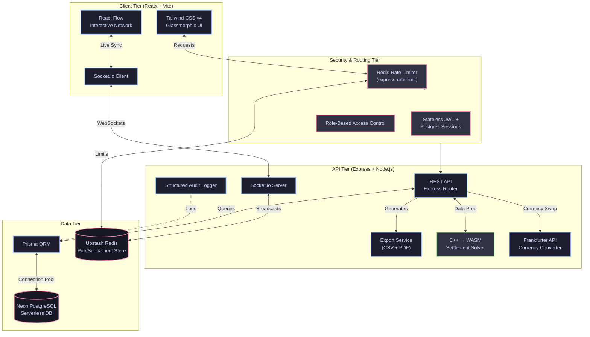

# CashFlow (public beta)

🚀 **Live Demo:** [https://cashflow-phi-amber.vercel.app/](https://cashflow-phi-amber.vercel.app/)

> An open-source group-expense tracker that turns net balances into a clear settlement plan.

> **Beta notice:** CashFlow is still under active development. Do not use it for sensitive or real-world financial data until the security and privacy documentation is complete.

## Key Features

- **Exact settlement for typical groups**: Finds the mathematically minimum number of payments when there are up to 12 people with non-zero balances.
- **Safe large-group fallback**: Uses a deterministic greedy algorithm for larger groups; it settles every balance in at most `N - 1` payments without claiming global optimality.
- **C++ → WebAssembly in production**: The container build compiles the settlement solver from C++ source, then the Node.js server executes that module. TypeScript mirrors the algorithm as a development fallback.
- **Accounts and roles**: JWT-based authentication, refresh-token rotation, and `ADMIN`, `MEMBER`, and read-only `AUDITOR` group roles.
- **Group tools**: Expense entry, settlement views, CSV/PDF exports, activity logs, and an interactive debt graph.
- **Receipt assistance**: Optional OCR receipt parsing with a local fallback. See the privacy documentation before enabling third-party OCR for real data.
- **Multi-currency input**: Converts supported currencies through Frankfurter when an expense is added.

## Screenshots
| | |
|:---:|:---:|
|  <br/> **Dashboard View** |  <br/> **Interactive Debt Graph** |
|  <br/> **Receipt Scanning** |  <br/> **Global Ledger** |

## Architecture


```mermaid
graph TD
    subgraph Client["Client Tier (React + Vite)"]
        UI["Tailwind CSS v4\nGlassmorphic UI"]
        WS_C["Socket.io Client"]
        Graph["React Flow\nInteractive Network"]
    end

    subgraph Security["Security & Routing Tier"]
        Rate["Redis Rate Limiter\n(express-rate-limit)"]
        Auth["Stateless JWT +\nPostgres Sessions"]
        RBAC["Role-Based Access Control"]
    end

    subgraph Server["API Tier (Express + Node.js)"]
        API["REST API\nExpress Router"]
        WS_S["Socket.io Server"]
        Audit["Structured Audit Logger"]
        Export["Export Service\n(CSV + PDF)"]
        Solver["C++ → WASM\nSettlement Solver"]
        Cur["Frankfurter API\nCurrency Converter"]
    end

    subgraph Data["Data Tier"]
        DB[(Neon PostgreSQL\nServerless DB)]
        ORM["Prisma ORM"]
        Redis[("Upstash Redis\nPub/Sub & Limit Store")]
    end

    %% Connections
    UI <--> |Requests| Rate
    Rate --> Security
    Security --> API
    
    Graph <--> |Live Sync| WS_C
    WS_C <--> |WebSockets| WS_S
    
    API <--> |Queries| ORM
    Audit -.-> |Logs| ORM
    
    WS_S <--> |Broadcasts| Redis
    Rate <--> |Limits| Redis
    
    API --> |Currency Swap| Cur
    API <--> |Data Prep| Solver
    API --> |Generates| Export
    
    ORM <--> |Connection Pool| DB
    
    classDef default fill:#1e1e2e,stroke:#89b4fa,stroke-width:2px,color:#cdd6f4;
    classDef database fill:#181825,stroke:#f38ba8,stroke-width:2px,color:#cdd6f4;
    classDef security fill:#313244,stroke:#f38ba8,stroke-width:2px,color:#cdd6f4;
    classDef algorithm fill:#313244,stroke:#a6e3a1,stroke-width:2px,color:#cdd6f4;
    
    class DB,Redis database;
    class Rate,Auth,RBAC security;
    class Solver algorithm;
```

## Tech Stack

| Layer | Technology |
|-------|-----------|
| Frontend | React 19, Vite 6, Tailwind CSS v4, React Flow |
| Backend | Node.js, Express 5, TypeScript, Socket.io |
| Algorithm | C++ (Graph Optimizer) → WebAssembly via Emscripten |
| Database | Neon (Serverless PostgreSQL) + Prisma ORM |
| Real-Time | Socket.io + Redis Pub/Sub (Upstash) |
| DevOps | Docker, Docker Compose |

## Quick Start

### Prerequisites
- Node.js ≥ 20
- [Neon](https://neon.tech) account (free — serverless PostgreSQL)
- [Upstash](https://upstash.com) account (free — serverless Redis)

### Infrastructure Setup

1. **Neon PostgreSQL**: Create a project → copy the connection string. Add `&connect_timeout=30&pool_timeout=30` to prevent serverless cold-start errors.
2. **Upstash Redis**: Create a database → copy the `rediss://` connection URL (TLS)
3. Copy `.env.example` → `apps/server/.env` and fill in your credentials. Receipt scanning uses `OCR_SPACE_API_KEY`; set `PREMIUM_RECEIPT_USER_IDS` to a comma-separated list of user IDs that should bypass the free 20 scans/hour limit.

### Local Development

```bash
# 1. Clone and install
npm install

# 2. Set up environment (fill in Neon + Upstash credentials, plus OCR_SPACE_API_KEY for receipt scanning)
cp .env.example apps/server/.env

# 3. Push database schema to Neon
cd apps/server && npx prisma db push && cd ../..

# 4. Seed demo data
cd apps/server && npx tsx src/prisma/seed.ts && cd ../..

# 5. Start backend
npm run dev:server

# 6. Start frontend (new terminal)
npm run dev:web
```

### Docker Compose (Full Stack)

```bash
docker compose up --build
```

- Frontend: http://localhost:3000 (Docker) / http://localhost:5173 (dev)
- Backend: http://localhost:4000
- API Health: http://localhost:4000/api/health


## Core Algorithm

CashFlow first converts every expense into a net balance for each group member. Settlement is then calculated in integer cents, so floating-point noise does not influence the plan.

1. For **up to 12 non-zero balances**, the solver exhaustively searches maximal debtor/creditor pairings and returns a plan with the mathematically minimum number of payments.
2. For **more than 12 non-zero balances**, it uses a deterministic greedy matcher. That plan is valid and uses at most `N - 1` payments, but it is not described as globally minimal.
3. Production containers compile and run the same strategy in C++/WebAssembly. The TypeScript implementation is a behavior-matched fallback for local development or a failed WASM load.

The 12-person exact limit is intentional: finding a global minimum is computationally expensive at arbitrary scale. The response includes the strategy used so the application can present it honestly.

## API Endpoints

| Method | Endpoint | Description |
|--------|----------|-------------|
| GET | `/api/health` | Server health check (DB ping included) |
| POST | `/api/auth/register` | Register user (Rate limited) |
| POST | `/api/auth/login` | Login & receive JWT |
| POST | `/api/auth/logout` | Revoke DB Session |
| POST/GET | `/api/users` | User CRUD |
| POST/GET | `/api/groups` | Group CRUD (Cursor paginated) |
| POST/DELETE | `/api/groups/:id/members` | Member management (ADMIN only) |
| PATCH | `/api/groups/:id/members/:userId/role` | Change member role |
| POST/GET | `/api/groups/:id/transactions` | Transaction CRUD (Paginated) |
| GET | `/api/groups/:id/settlements` | Compute minimized debts |
| GET | `/api/groups/:id/exports/csv` | Download CSV Ledger |
| GET | `/api/groups/:id/exports/pdf` | Download PDF Summary |
| GET | `/api/audit-logs` | Paginated activity logs for the authenticated user's groups |

## Project Structure

```
CashFlow-Management/
├── apps/
│   ├── web/                 # React + Vite frontend
│   │   ├── src/
│   │   │   ├── components/  # Sidebar, Layout, DebtGraph, ExpenseModal
│   │   │   ├── pages/       # GroupsPage, GroupDetailPage
│   │   │   ├── hooks/       # useApi, useSocket
│   │   │   ├── lib/         # API client, Socket client
│   │   │   └── types/       # TypeScript interfaces
│   │   └── Dockerfile
│   │
│   └── server/              # Express + TypeScript backend
│       ├── src/
│       │   ├── routes/      # users, groups, transactions
│       │   ├── services/    # Business logic + solver
│       │   ├── middleware/  # Validation, error handling
│       │   ├── socket/      # Socket.io server
│       │   ├── wasm/        # WASM loader bridge
│       │   └── prisma/      # Schema + seed
│       └── Dockerfile
│
├── packages/
│   └── solver/              # C++ → WebAssembly solver
│       ├── src/solver.cpp
│       ├── CMakeLists.txt
│       └── build.sh
│
├── docker-compose.yml
└── package.json
```

## License

MIT
