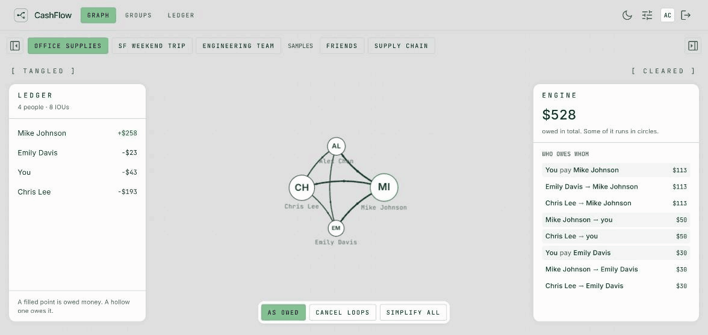
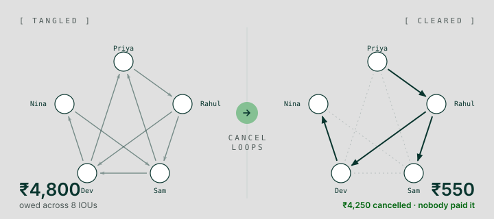
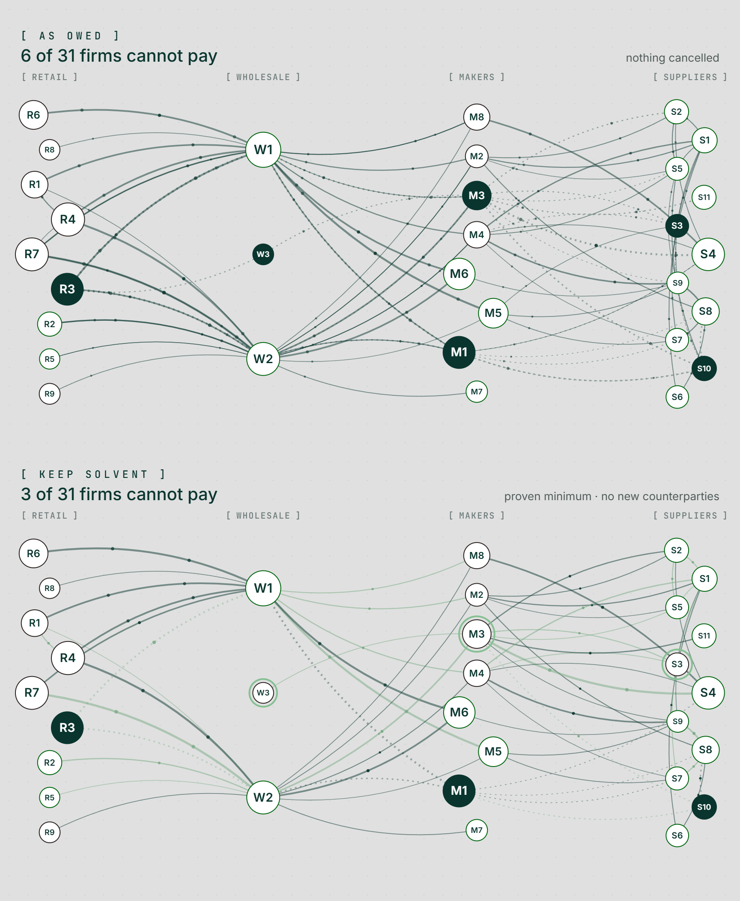

<div align="center">

# CashFlow

**Some of what your group owes runs in circles. It can be struck off without anyone paying.**

[](https://github.com/SanishKumar/Cashflow/actions/workflows/ci.yml)
[](LICENSE)
[](package.json)
[](#verifying-the-repository)

[Live demo](https://cashflow-phi-amber.vercel.app/) · [How it works](#how-it-works) · [When someone can't pay](#when-someone-cant-pay) · [The engine](#the-clearing-engine) · [Run it locally](#run-it-locally)

</div>



<sub>Real data, real engine. Eight IOUs, $528 outstanding — $190 of it cancels with nobody paying and nobody owing a stranger. Then the sample supply chain: six firms can't pay as things stand, and choosing what to cancel gets that down to three.</sub>

---

## The idea

Five friends, eight IOUs, ₹4,800 outstanding. But Priya owes Rahul, Rahul owes Sam, and Sam owes Priya — that loop is money chasing its own tail. It can be cancelled outright. Nobody pays anything, nobody's net position changes, and nobody ends up owing a stranger.

Do that everywhere it occurs and ₹4,800 becomes ₹550 across four payments.



Every expense app has a *simplify debts* button. It goes further than this — and to do it, it quietly makes people owe strangers. Splitwise's own documentation admits it "makes changes not only to your account, but also to the accounts of your friends — including balances that you can't see."

CashFlow makes that a choice, shows what each option costs, and lets you take the one you can live with.

|  | Cancel loops | Simplify all |
| --- | --- | --- |
| Clears | Closed loops only | Loops **and** open chains |
| New counterparties | **Never any** | Yes — and it names them |
| Net positions | Unchanged | Unchanged |

That table is the whole story for as long as everybody pays. [The section after next](#when-someone-cant-pay) is about when they don't.

## How it works

**The graph is the interface.** There's no dashboard summarising a system you can't see — you land in the money graph itself. People are nodes, debts are edges, and money flows along them as you watch.

- **Pick a mode.** *As owed* shows the tangle. *Cancel loops* never hands anyone a new counterparty. *Simplify all* is the aggressive option, with its cost stated up front.
- **See what it costs.** Every mode reports how much cleared, how many payments remain, and exactly how many people would end up owing someone new.
- **Ask what happens if someone can't pay.** Pick anyone on the graph and every mode shows who is left out of pocket — and flags anyone the plan exposed who wasn't exposed before.
- **Instant.** The clearing engine runs in your browser, so switching modes never touches the server.
- **Give the graph the screen.** Every panel folds away — the sheet on a phone, either column on a desk — and stays the way you left it.
- **Scan a receipt.** Photograph a bill and the items, total, tax and tip are read off it — with an honest score for how much of that the parser could actually verify.

Everything else you'd expect is there: groups with roles, an audit trail, realtime updates, CSV and PDF export, multi-currency.

> **CashFlow records who owes whom. It never connects to a bank or moves money.**

## When someone can't pay

Clearing is always explained with everyone paying in full. Here is the other case, in five obligations.

Dara owes Asha and Bo 100 each. Asha, Chen and Dara owe one another 100 round a loop. Bo is outside the loop and owes his own supplier 45. Dara has 20 to his name, Asha 35, Chen 100 and Bo nothing.

| What gets cancelled | Who goes under |
| --- | --- |
| Nothing | Dara and **Asha** |
| The whole loop | Dara and **Bo** |
| 23 to 54 of the loop's 100 | Dara |

Dara fails every time — clearing never changes a net position, so nothing it does can reach him. The other two are the point. Leave the loop alone and Dara's estate is his 20 plus the 100 Chen pays him, shared between two creditors. Asha gets 60, which with her own 35 leaves her 5 short of what she owes Chen. Cancel the loop and Asha owes nobody, but the estate is down to the 20, all of it goes to Bo, and Bo needed 45.

Cancelling a loop is a **priority jump** once someone in it can't pay. The loop's members are settled against each other in full, and the failing party's other creditors share what is left. No net position moved, nobody was handed a counterparty, and a firm that was never in the loop went under because of it. So "cancel loops is safe" needs its condition attached: safe while everyone in the loop is good for what they owe.

The third row is the interesting one. Somewhere between cancelling nothing and cancelling everything there is an amount that loses neither of them, and the usual advice — clear as much as you can — walks straight past it.



<sub>The sample supply chain in the app, drawn by the app. Same debts, same cash. Inked-in firms cannot pay; a green ring marks one the plan saved.</sub>

### What the engine does about it

```ts
import { cascade, rescue } from "@cashflow/clearing";

cascade(obligations, cash).waves;  // who fails, in the order they fail

const plan = rescue(obligations, cash);
plan.outcome.failed;               // who fails under the clearing it chose
plan.unavoidable;                  // who fails under any clearing at all
plan.provablyBest;                 // true when those are the same parties
```

- **`cascade`** works out who fails, in what order, and what everyone actually collects. It is the Eisenberg–Noe clearing vector with Rogers–Veraart recovery rates, found by the fictitious default method so the cascade comes out as waves: the first wave could not have paid even if paid in full, and every later wave was solvent on paper and dragged down.
- **`rescue`** searches for the cycle clearing that leaves the fewest parties unable to pay. Its main move is to cancel a party's claim on a failed debtor at face value, by routing it round a loop back to that debtor. It tries the smallest amount that works first, since everything cancelled for one creditor comes out of the estate the others share, and it keeps a move only after resolving the entire network again. It never trusts its own estimate of what a move does. Like any cycle clearing, the result only reduces obligations: no net position moves and no counterparty is created.
- **A proven floor.** Some parties fail under every possible clearing, and that set can be bounded: the most of any claim that could ever be cancelled is the maximum flow from the creditor back to the debtor. If the plan loses nobody beyond that set, it is optimal and `provablyBest` says so. If it loses more, the difference is the most the search can be wrong by.

Picking the best clearing is a hard problem, not a tuning exercise. It is NP-hard, and stays NP-hard when the question is only whether one named firm can be saved ([Csáji, Mateiu, Popa and Schlotter, 2026](https://arxiv.org/abs/2603.27155)). Their exact method is a mixed-integer program which, in their own experiments — some of them on samples from Romania's national netting system — stopped finishing inside an hour once a network passed 100 firms. This is a search with a bound rather than an exact method, and that is the trade it makes to get further.

The people building clearing networks leave the same question open. The Cycles protocol paper lists the effect on default probabilities and contagion among "hypotheses that require pilot testing" ([Fleischman and Buchman, 2026](https://arxiv.org/abs/2605.02436)).

### How well it does

`npm run bench:rescue` — seeded and reproducible.

**Against ground truth.** On a network of half a dozen parties every whole-number clearing can simply be tried, which gives a true optimum to score against.

| | Nothing lost in failure | Failure destroys value |
| --- | --- | --- |
| Networks enumerated | 2,993 | 2,993 |
| Search finds the optimum | **99.73%** | **99.77%** |
| When it misses, it is off by | 1 party | 1 party |

**At a size the exact method doesn't reach.** Supply chains with a thin cash cushion and one net debtor in eight short of working capital. Figures are parties that fail, averaged over ten seeds; lower is better.

```
nothing lost in failure

network                          as owed  maximum  rescue  floor  gap to floor  fewer than max  time
-------------------------------  -------  -------  ------  -----  ------------  --------------  -------
273 firms, 1,687 obligations     26.9     25.5     22.1    20.2   8.6%          13.3%           30 ms
911 firms, 6,510 obligations     98.5     93.1     80.3    76.0   5.4%          13.7%           515 ms
829 firms, 2,828 obligations     81.7     79.3     74.2    71.0   4.3%          6.4%            195 ms
2,733 firms, 18,939 obligations  280.6    269.2    230.0   213.7  7.1%          14.6%           8.9 s

failure destroys value (60% of cash, 80% of receivables recovered)

273 firms, 1,687 obligations     48.4     31.9     26.1    21.2   18.8%         18.2%           81 ms
911 firms, 6,510 obligations     235.4    138.4    104.9   81.9   21.9%         24.2%           1.3 s
829 firms, 2,828 obligations     118.9    105.8    92.3    80.7   12.6%         12.8%           324 ms
2,733 firms, 18,939 obligations  645.3    405.6    303.8   229.1  24.6%         25.1%           17.9 s
```

*Maximum* is what clearing systems do today: cancel everything that can be cancelled. *Rescue* is this engine's plan. *Floor* is proven, so the true optimum sits somewhere between the last two columns of numbers.

Read it as three results. Maximum clearing already helps, a great deal once failure destroys value. Choosing what to cancel helps again: 6–15% fewer failures when nothing is lost, 13–25% fewer when it is. And where nothing is lost the plan is within 4–9% of a bound that no clearing can beat.

### What this is not

- **Not an exact solver.** Outside the cases where it meets the floor, the plan comes with no guarantee beyond the gap shown. Where failure destroys value that gap is 13–25%, and some of that is the floor being loose rather than the search being wrong. I can't tell you how much.
- **Not real balance sheets.** Invoice data says who owes whom, not who can pay, so the cash positions are generated ([`balance.ts`](packages/clearing/src/balance.ts) says how). The tables show that the effect exists and roughly how big it is under those assumptions. They are not a forecast for any real economy.
- **Not insolvency law.** The model is one period and pro rata: no secured creditors, no order in which payments fall due, no court unwinding a set-off made shortly before a collapse. Each of those would change the numbers.
- **Not a claim that clearing is dangerous.** Maximum clearing beats doing nothing in every row above. The claim is narrower: what you cancel matters as well as how much, and it can be chosen.

## The clearing engine

[`packages/clearing`](packages/clearing) is a standalone, dependency-free package. It is the reason this project exists.

```ts
import { clear, verifyClearing } from "@cashflow/clearing";

const safe = clear(obligations, { mode: "cycles" });
safe.metrics.noNewCounterparties;  // always true
safe.metrics.cleared;              // debt that evaporated

const aggressive = clear(obligations, { mode: "paths" });
aggressive.metrics.newPairs;       // exactly who now owes someone new

const round = clear(obligations, { mode: "cycles", solver: "routing" });
verifyClearing(obligations, round.remaining, round.certificate!);  // { valid: true }
```

A party can also refuse one specific exposure without opting out of clearing, via `forbiddenPairs`.

That last line is worth a sentence. A clearing from the `routing` or `simplex` solver comes with a certificate — one number per party — and `verifyClearing` uses it to confirm, in a single pass and without running any solver, that nothing was created, no net position moved, and no further loop could have been cancelled. An operator can publish the obligations, the result and the certificate, and every participant can check the round for themselves.

<details>
<summary><b>How cycle clearing is solved — three ways</b></summary>

<br>

Cycle-restricted clearing is a **maximum-circulation** problem. A flow that respects every obligation as a capacity and conserves value at every party cannot change anyone's net position — conservation *is* the guarantee — so maximising total flow maximises the debt that simply cancels. That's a minimum-cost circulation with a cost of −1 per unit.

Three solvers reach that optimum by unrelated routes, and the test suite holds them to the same answer on hundreds of randomised networks each.

**Cycle cancelling** ([`circulation.ts`](packages/clearing/src/circulation.ts)) is the reference method and the default. It saturates directed cycles by depth-first search, then cancels negative-cost cycles in the residual network until none remain; a circulation is optimal exactly when its residual has no negative cycle. The negative-cycle search is queue-driven Bellman-Ford that catches a cycle the moment it forms, by checking whether a relaxation would close a loop in the predecessor tree. The textbook SPFA test — waiting for a relaxation counter to exceed the node count — measured about 25× slower here.

**Routing** ([`routing.ts`](packages/clearing/src/routing.ts)) solves it from the other side. The most that can cancel is the total minus the least that has to stay, and what stays must still carry every party's net position through obligations that already exist. So the residue of an optimal clearing is the cheapest way to route net debt along existing obligations, at a cost of one per obligation crossed. Unit costs mean route lengths are small whole numbers, so the solver takes them in order: find the shortest remaining route length, saturate every route of that length at once with a blocking flow, move up. This is the fast one.

**Network simplex** ([`simplex.ts`](packages/clearing/src/simplex.ts)) is a general minimum-cost flow solver — supplies, arbitrary integer costs, unbounded arcs — kept strongly feasible so degenerate pivots cannot cycle. It is the one to reach for when the problem stops being a pure circulation.

Before either of the large-network solvers runs, the network is cut into strongly connected components ([`components.ts`](packages/clearing/src/components.ts)). A cycle never leaves its component and most of a supply chain is not circular at all, so obligations between components are set aside. The potentials are then shifted per component until those obligations satisfy the optimality conditions too, which is why the certificate covers the whole network and not just the part that was solved.

Path compensation then lifts intermediaries out of open chains until nobody sits in the middle, which drives the total down to the **floor**: the sum of all positive net positions, the least any net-preserving method can leave outstanding.

Amounts are integer minor units throughout. Clearing adds and subtracts these thousands of times, and floating point would let rounding error accumulate into the settlement instructions themselves.

</details>

### What it clears

`npm run bench:clearing` — seeded and reproducible.

```
network                      pairs  gross        cycles  paths   new pairs (cyc/path)
---------------------------  -----  -----------  ------  ------  --------------------
friends group                15     198,854      23.77%  45.12%  0 / 0
unstructured cluster         2756   26,555,348   57.33%  71.24%  0 / 509
supply chain (5 tiers)       2598   24,763,077   27.76%  63.42%  0 / 882
supply chain (8 tiers)       4966   46,821,748   20.41%  62.87%  0 / 2151
regional supply chain        13935  122,584,346  22.88%  64.02%  0 / 6703
```

Two things worth reading carefully.

**Topology decides everything.** Real trade is hierarchical — a retailer owes a wholesaler owes a manufacturer — and a purely hierarchical network is acyclic, leaving loop clearing nothing to cancel. The unstructured row is *not* representative; the supply-chain rows are. [arXiv 2606.26126](https://arxiv.org/abs/2606.26126) reports **20.99%** for cycle-restricted netting across 133,191 real invoices worth €19.67bn, and the 8-tier network here independently lands at **20.41%**.

**The extra relief is bought with exposure.** On the regional network, moving from `cycles` to `paths` clears another 41% — and manufactures **6,703 counterparty relationships that did not previously exist**.

This isn't a toy problem. Slovenia's AJPES runs national multilateral set-off, clearing €683M in 2012 — 1.89% of GDP — across 14,000 companies, with demand rising counter-cyclically during liquidity crises ([research](https://www.mdpi.com/1911-8074/13/12/295)).

### How far it scales

`npm run bench:scale`. The sizes are taken from published figures for real systems; the networks are synthetic.

```
regional supply chain  —  the largest network in bench/run.ts
  1,840 firms, 13,935 obligations
  routing              83 ms   certificate verified in 1 ms
  network simplex     122 ms   certificate verified in 0 ms
  cycle cancelling   14.32 s   173x the routing time
  cleared 22.88% of gross, every solver agreeing

national monthly round  —  AJPES, Slovenia: 5,880,447 obligations over 111 rounds
  18,831 firms, 51,375 obligations
  routing             1.26 s   certificate verified in 3 ms
  network simplex     2.59 s   certificate verified in 1 ms
  cleared 7.85% of gross, every solver agreeing

published invoice corpus  —  arXiv 2606.26126: 133,191 invoices
  33,540 firms, 122,456 obligations
  routing             4.88 s   certificate verified in 3 ms
  network simplex    31.75 s   certificate verified in 4 ms
  cleared 10.98% of gross, every solver agreeing
```

A round the size Slovenia runs each month clears exactly in about a second, on a laptop, and the proof that it is maximal checks in three milliseconds. A network generated at the size of the Italian invoice data used in the Cycles whitepaper — 1.18 million obligations among 554,000 firms — took a little over six minutes (`npm run bench:scale register`). That one is correct but not yet fast: most of the time goes into repeated blocking-flow searches, which is the obvious thing to improve next.

Timings move from machine to machine. The optima do not, and every one above was re-verified from its certificate.

## Run it locally

You'll need Node.js 20+, PostgreSQL and Redis.

```bash
git clone https://github.com/SanishKumar/Cashflow.git
cd Cashflow
npm install
cp .env.example apps/server/.env
```

Set `DATABASE_URL`, `REDIS_URL`, `JWT_SECRET` and `CORS_ORIGIN` in `apps/server/.env`, then:

```bash
npm run db:migrate:deploy && npm run db:seed
```

Two terminals:

```bash
npm run dev:server
```

```bash
npm run dev:web
```

The app is on `http://localhost:5173`, the API on `http://localhost:4000`. Seeded accounts are printed by the seed script. Set `APP_URL` if links should point somewhere other than `CORS_ORIGIN`.

The graph, both sample networks and every clearing mode work with only the second of those running — the engine is in the browser and the samples need no account.

### Verifying the repository

```bash
npm run verify
```

ESLint, a strict typecheck of the engine, all three test suites (server, web, clearing — 240 tests), the server TypeScript build and the production Vite build. CI runs the same command and audits production dependencies.

The three benchmarks are separate, because they measure rather than assert:

```bash
npm run bench:clearing   # what clears, and what it costs in new counterparties
npm run bench:scale      # exact clearing at the sizes real systems run at
npm run bench:rescue     # solvency-aware clearing against ground truth
```

## Under the hood

| Layer | Built with |
| --- | --- |
| Web | React 19, TypeScript, Vite, Tailwind CSS |
| Graph | Hand-rolled canvas renderer — force and lane layouts, particle flow, no graph library |
| Clearing | Dependency-free TypeScript, runs in the browser |
| API | Express 5, TypeScript, Zod |
| Data | PostgreSQL, Prisma, integer minor units end to end |
| Realtime | Socket.io over Redis, membership-checked rooms |
| Auth | Rotating refresh sessions, bcrypt, in-memory access tokens |
| Testing | Vitest, Testing Library, Supertest |

A few things that took real care:

- **Nothing in the engine is trusted on its own word.** Three solvers have to agree. Optima come with certificates that are checked without a solver. The solvency search is scored against exhaustive enumeration, and re-resolves the whole network before keeping any move.
- **Server-enforced roles.** Admins manage a group, members add and settle, auditors read. Checked on the server, never inferred in the client.
- **Scoped audit trail.** Group, expense, role and settlement events are recorded without leaking activity across groups you don't belong to.
- **Fixed-point money.** PostgreSQL decimal columns and cent-based arithmetic throughout. No floating-point drift in a stored balance.
- **Receipt parsing that admits what it doesn't know.** Confidence is scored from whether a total line was found, whether items were read, and whether they reconcile — not a constant dressed up as a model score.

## Project layout

```
packages/clearing/     Clearing engine, default cascade, solvency search, benchmarks, tests
apps/web/              React app — money graph, groups, ledger
apps/server/           Express API, services, socket server
apps/server/prisma/    Schema and versioned migrations
packages/solver/       Optional C++/WebAssembly minimum-transfer solver
docs/                  Deployment notes, figures
```

Reviewing the code? The engine reads in this order: the reference [circulation solver](packages/clearing/src/circulation.ts), then [routing](packages/clearing/src/routing.ts) for the same problem turned inside out, then the [default cascade](packages/clearing/src/cascade.ts) and the [solvency search](packages/clearing/src/rescue.ts) with its bound. After that: the [canvas graph](apps/web/src/components/MoneyGraph.tsx), the [obligation graph endpoint](apps/server/src/services/transactionService.ts), and the [security model](SECURITY.md).

## Deployment

Vercel for the frontend, Render for the API. HTTP traffic is reverse-proxied through the Vercel origin so the refresh cookie stays first-party, while Socket.io connects directly with a short-lived access token. Full checklist in [docs/DEPLOYMENT.md](docs/DEPLOYMENT.md).

## License

[MIT](LICENSE) · [Security](SECURITY.md) · [Privacy](PRIVACY.md)
